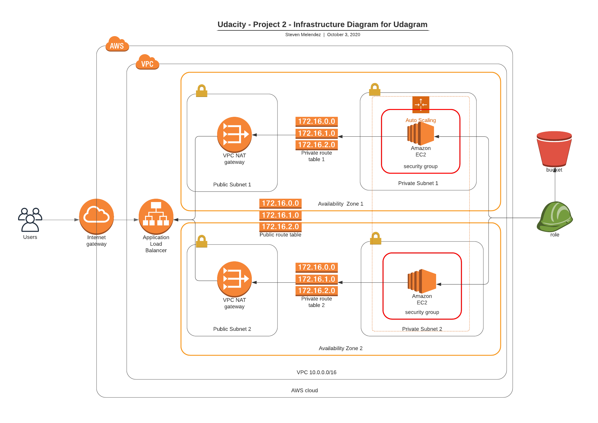

## Problem Description
Your company is creating an Instagram clone called Udagram. Developers pushed the latest version of their code in a zip file located in a public S3 Bucket.
You have been tasked with deploying the application, along with the necessary supporting software into its matching infrastructure.
This needs to be done in an automated fashion so that the infrastructure can be discarded as soon as the testing team finishes their tests and gathers their results.

## Project Requirements
Create a Launch Configuration in order to deploy four servers, two located in each of your private subnets. The launch configuration will be used by an auto-scaling group. You'll need two vCPUs and at least 4GB of RAM. The Operating System to be used is Ubuntu 18.

## Diagram

### Files included:

- Network.yaml
- Network-params.json
- Services.yaml 
- Services-params.json
- Run-networks.sh
- Run-services.sh
- Udagram.png
- It_works.png

### Running the project:

1. Execute network infrastructure stack.
  Use the file run-networks.sh create

2. Once step 1 is succesfully completed, execute services infrastructure stack
  Use the file services.yaml create

### Output

### References

1. https://github.com/Houlis-Udacity-Nanodegrees/Deploy-a-High-Availability-Web-App-Using-CloudFormation
2. https://github.com/mehmetincefidan/Deploy-a-High-Availability-Web-App-Using-CloudFormation
3. https://github.com/maxgherman/udacity-cloud-devops-engineer/tree/master/highly-available-website
